# ETL Process - Taking a Data Set and Storing it in PostgreSQL 

Our data comes from a Kaggle: a fake dataset provided by Prasad Patil:
[Prasad's Dataset](https://www.kaggle.com/datasets/prasad22/healthcare-dataset/data)

You'll need to either download it to your device directly or utilize Kaggle's API key shenanigans. 
Since we're using Docker, you don't need to download Postgres or PGAdmin: We can just grab images via our Docker Compose file. 
From there, you can set your own Postgres Username, Password, and Database Name in whichever way you want, and the same goes for the PGAdmin user email and password-
I wanted to avoid hardcoding most of it for practicing security habits. 

### (I'll probably get a Dockerfile going and hopefully create an image so we can containerize the script and avoid downloading a bunch of possibly conflicting modules.)

From there, you can use Docker-Compose Up -d to create a docker network that pulls your images and runs your containers. Use -d for a detached mode so you don't have to
open a bunch of terminals:

`docker-compose up -d`

I recommend using Code Spaces to ensure private visibility of your ports. 
I used Jupyter Notebook initially to run code cell by cell to help trouble shoot, then converted it into a script by running this in my terminal:

`jupyter nbconvert --to=script notebook.ipynb`

You don't need to use Jupyter or the above, though! You can just run the below in your terminal after installing the necessary modules (Pandas, SQLAlchemy, Kagglehub, Psycopg3):

`python pipeline.py`

Our script is currently procedural and super basic - our cleaning focuses on asserting datatypes and making the patients names look a little nicer. We also take the billing and round it
out to 2 decimal places.

Jupyter wise, I used Pandas to make on big initial dataframe to clean a few columns, and then split it into smaller dataframes, and then loaded each into the database using SQLAlchemy
with Psycopg as my database driver. 

### Our initial dataframe asserting the columns data types, parsing dates, and removing duplicates:

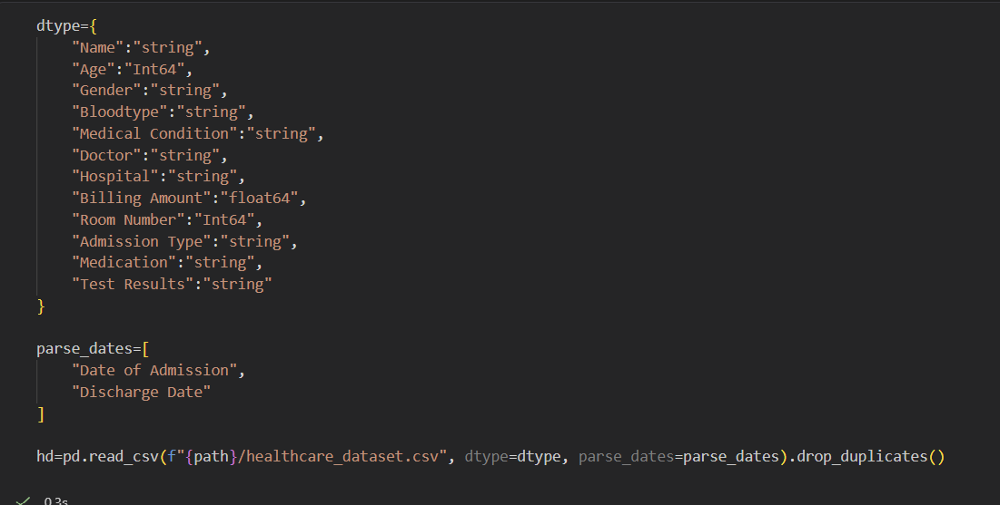

### Our data before cleaning: 

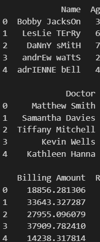

### Our Data after cleaning:

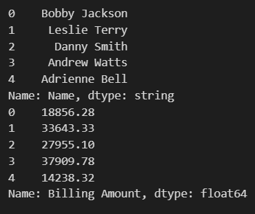

### I also checked for null values (there appear to be none, so maybe this dataset was a bit too clean already?):

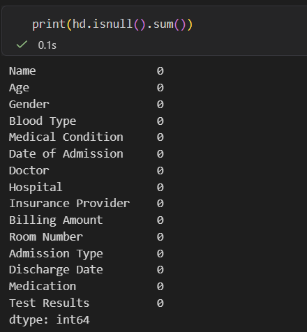

### Disclaimer: this dataset is a synthetic one, generated by Prasad. For security reasons (and healthcare related things like HIPAA), never show a data set with a real person's information!

We can check our database schema before connecting:

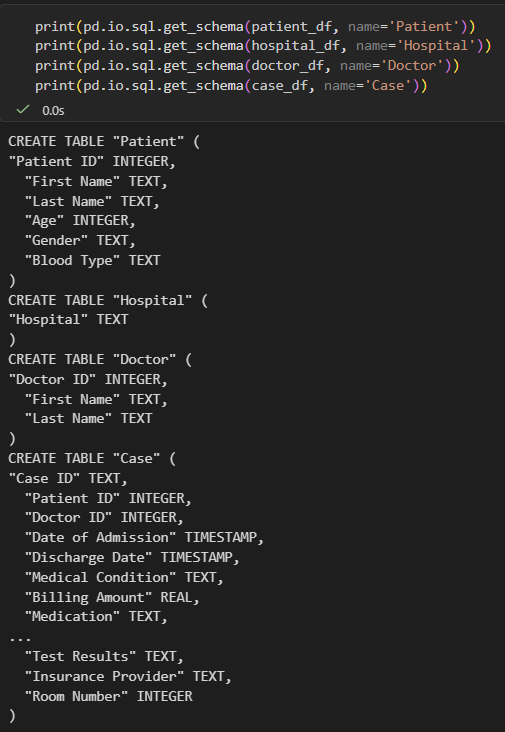

I also added some IDs for some of the tables as primary keys:

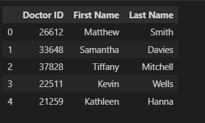

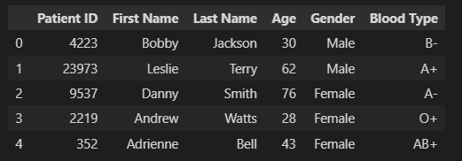

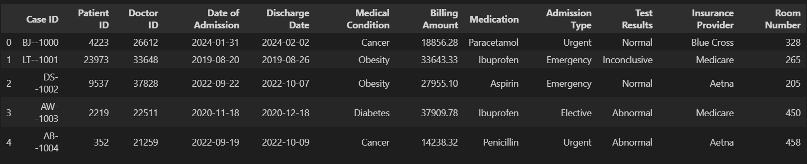

We use our Dockerfile to take our script and turn it into a Docker Image. This ensures we don't need to download every dependency to make our 
script work:

`docker build -t pipeline:v01 .`

Then, we use docker run to create a container (CLI arguments use os.environ.get to feed the information into our engine):

`docker run --rm -it \
--network healthcare_data_engineering_default \
-e DB_USER="$DB_USER" \
-e DB_PASSWORD="$DB_PASSWORD" \
-e DB_NAME="$DB_NAME" \
-e DB_HOST=pgdatabase \
-e DB_PORT=5432 \
-e KAGGLE_USERNAME="$KAGGLE_USERNAME" \
-e KAGGLE_KEY="$KAGGLE_KEY" \
pipeline:v01`

From here, we first add the table names to PostgreSQL (and use replace to prevent redundancy when repeating our script):

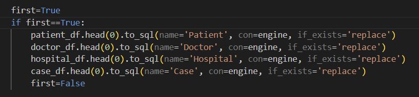

And now I finally add the data to the PostgreSQL database:

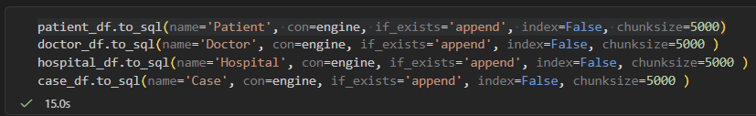

From there, click on your PGAdmin port and sign in with your PGAdmin user/email and password. 
In PGAdmin, right click servers, go to register, and then to server. 
From there, you'll start in the general tab-give it whatever name you want.
Then, from the connection tab, you'll need to enter the name of the host (I used pgdatabase), your postgreSQL port, as well as your database user name and password. 
Save, and then go to the tab with your Database name, go to schemas, then public, then tables, and here's the results:

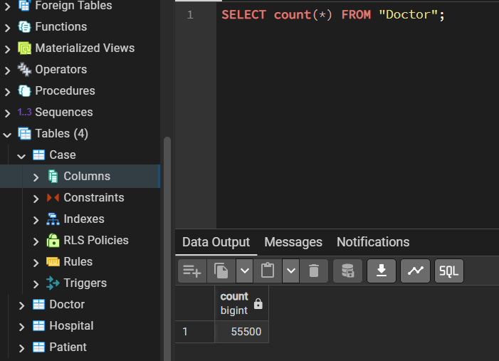

Our count query displays that the data has been moved (in chunks of 5000 for each table) into the table. 
